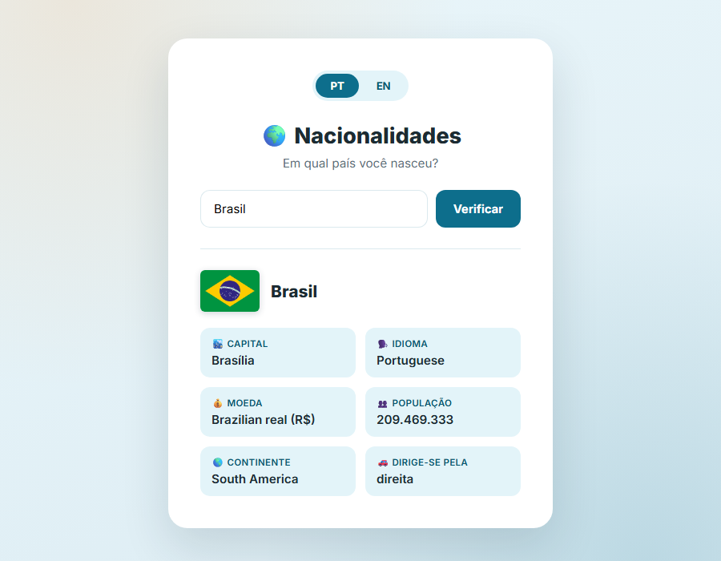

# Nationalities App | App de Nacionalidades

[🌐 See it live / Veja ao vivo]: https://gabriela-matsas.github.io/nationalities-app/

**EN:** App to discover any country's info: capital, language, currency, population, continent, and driving side.  
**PT:** App para descobrir informações de qualquer país: capital, idioma, moeda, população, continente e lado de direção.

---

## Features | Funcionalidades

- 🌍 Search for any of 250 countries, in English or Portuguese, accent/case-insensitive
- 💡 Autocomplete suggestions as you type
- 🏳️ Displays the country's flag
- 🏙️ Shows the capital city
- 🗣️ Shows the official language
- 💰 Shows the official currency
- 👥 Shows the population
- 🌎 Shows the continent
- 🚗 Shows the side of the road for driving
- 🇬🇧/🇵🇹 Language toggle: English & Portuguese

- 🌍 Pesquise qualquer um dos 250 países, em inglês ou português, sem se preocupar com acento/maiúsculas
- 💡 Sugestões automáticas enquanto você digita
- 🏳️ Exibe a bandeira do país
- 🏙️ Mostra a capital
- 🗣️ Mostra o idioma oficial
- 💰 Mostra a moeda oficial
- 👥 Mostra a população
- 🌎 Mostra o continente
- 🚗 Mostra o lado da direção no país
- 🇬🇧/🇵🇹 Troca de idioma: Inglês e Português

---

## How to Use | Como Usar

1. Open `index.html` in a browser | Abra `index.html` em um navegador  
2. Type the country name (English or Portuguese) | Digite o nome do país (em inglês ou português)  
3. Click "Verify" | Clique em "Verificar"  
4. View all the country info! | Veja todas as informações do país!

---

## Technologies | Tecnologias

- HTML
- CSS
- JavaScript
- Country data for all 250 countries embedded locally (`scriptnacionalidades.js`) — no external API calls at runtime, so it always works instantly and offline. Built from open datasets via `build-data.js` (see that file for sources/how to refresh it). This replaced an earlier version that called the REST Countries API directly, which became unreliable after that API was deprecated.
- Flags served by [flagcdn.com](https://flagcdn.com), with an emoji fallback if that's unreachable.

---
## Screenshot / Captura de tela

## License | Licença

MIT License
